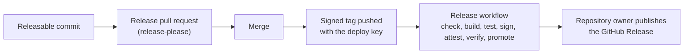

# workflow-container-factory

[](https://github.com/nwarila-platform/workflow-container-factory/actions/workflows/ci.yaml?query=branch%3Amain)

This repository builds and releases the organization's workflow containers. It gives independently
versioned checks one CI gate, one release process, and verifiable supply-chain evidence.

## What a workflow container is

A workflow container is a small image that a CI workflow runs as one check. The organization's shared
runner gives it no network access, a read-only root file system, and no Linux capabilities. Factory
images run as user and group ID `65532`.

## What every release carries

Each release provides one multi-architecture image for `linux/amd64` and `linux/arm64`. The release
workflow pushes the image by digest first. After the image and its evidence pass verification, the
workflow adds a version tag and a `sha-<commit>` tag. It never adds a `latest` tag.

The image index and both architecture-specific images have keyless Sigstore signatures. Their exact
certificate identity is:

```text
https://github.com/nwarila-platform/workflow-container-factory/.github/workflows/build.yaml@refs/tags/<name>/v<version>
```

The image index also has a GitHub build-provenance attestation. Each architecture has an SPDX
software bill of materials (SBOM) bound to that architecture's image digest.

An immutable GitHub Release completes the release. It contains a digests file, both SPDX SBOMs, and
the GitHub provenance bundle.

## Why the identity can be trusted

A release-tag push runs the workflow files from the tagged commit. For that reason, repository rules
allow only repository administrators and one write deploy key to create or update
`<name>/v<version>` tags. The private half of that key is stored as a secret in the `release`
environment, and only `main` may use that environment. For non-administrators, repository rules require
the tagged commit to be signed and prevent deleting or force-moving tags. The release workflow separately
requires a signed annotated tag object. Published GitHub Releases are immutable.

The organization's [shared runner](https://github.com/nwarila-platform/.github/blob/main/.github/workflows/run-container.yaml)
verifies the image by digest and requires the exact certificate identity above. It then requires all
five requirement labels before it runs the image.

## How a release happens

1. A releasable change to a container lands on `main`.
2. release-please opens or updates that container's release pull request.
3. Merging the release pull request updates the container's version and changelog.
4. The tagging job creates a signed tag and pushes it with the deploy key.
5. The tag starts the release workflow, which checks the tag, builds and tests both architectures,
   signs and attests the image, verifies the evidence, and promotes the digest to the two image tags.
6. The repository owner runs `tools/github-release.sh` to publish the GitHub Release and its evidence.



The final step is manual because GitHub does not let the workflow token create a release for a
protected tag in this organization repository. An organization-owned GitHub App is the planned way
to automate that step.

## Verify a release yourself

The first check needs [Crane](https://github.com/google/go-containerregistry/tree/main/cmd/crane),
[Cosign](https://docs.sigstore.dev/cosign/system_config/installation/), and an authenticated
[GitHub CLI](https://cli.github.com/). Set `name` and `version` to a release listed on the
[Releases page](https://github.com/nwarila-platform/workflow-container-factory/releases).

```sh
name='<container name>'
version='<release version>'
image="ghcr.io/nwarila-platform/workflow-${name}"
digest=$(crane digest "${image}:${version}")

cosign verify "${image}@${digest}" \
  --certificate-identity "https://github.com/nwarila-platform/workflow-container-factory/.github/workflows/build.yaml@refs/tags/${name}/v${version}" \
  --certificate-oidc-issuer https://token.actions.githubusercontent.com \
  --output text
gh attestation verify "oci://${image}@${digest}" \
  --repo nwarila-platform/workflow-container-factory \
  --signer-workflow nwarila-platform/workflow-container-factory/.github/workflows/build.yaml \
  --source-ref "refs/tags/${name}/v${version}"
```

The second check needs an authenticated GitHub CLI and standard `awk` and `mktemp` utilities. It
downloads every GitHub Release asset and verifies the saved provenance bundle.

```sh
name='<container name>'
version='<release version>'
image="ghcr.io/nwarila-platform/workflow-${name}"
release_dir=$(mktemp -d)

gh release download "${name}/v${version}" \
  --repo nwarila-platform/workflow-container-factory \
  --dir "$release_dir"
digest=$(awk '$1 == "index" { print $2 }' \
  "$release_dir/${name}-${version}-digests.txt")
gh attestation verify "oci://${image}@${digest}" \
  --bundle "$release_dir/${name}-${version}-provenance.sigstore.json" \
  --repo nwarila-platform/workflow-container-factory \
  --signer-workflow nwarila-platform/workflow-container-factory/.github/workflows/build.yaml \
  --source-ref "refs/tags/${name}/v${version}"
```

## Requirement labels

Every image declares five labels with a value of `true` or `false`. They tell the runner which inputs
and permissions the check needs:

- `org.nwarila.workflow.scratch` asks for a writable, restricted `/tmp` mount.
- `org.nwarila.workflow.full-history` asks for a workspace checkout with full Git history.
- `org.nwarila.workflow.second-input` asks for pinned template checkouts mounted read-only.
- `org.nwarila.workflow.sarif` says the check produces a SARIF report for the runner to upload.
- `org.nwarila.workflow.image-input` asks the runner to make a separately built image available to the
  check.

## Containers

| Name | What it checks | Image | Documentation |
| --- | --- | --- | --- |
| `runner-selftest` | The isolation applied by the shared runner | `ghcr.io/nwarila-platform/workflow-runner-selftest` | [README](containers/runner-selftest/README.md) |
| `template-drift` | A repository's files against pinned templates | `ghcr.io/nwarila-platform/workflow-template-drift` | [README](containers/template-drift/README.md) |

See the [Releases page](https://github.com/nwarila-platform/workflow-container-factory/releases) for
available versions.

## Repository layout

- `containers/` contains each container's source, `Containerfile`, version, tests, and example.
- `tools/check-labels.sh` validates the five requirement labels.
- `tools/check-index.py` validates the multi-architecture image and confirms that each architecture has
  its own SPDX SBOM.
- `tools/test_check_index.py` tests the index validator without a registry.
- `tools/install-crane.sh` installs the reviewed Crane version used by the workflows.
- `tools/github-release.sh` verifies and publishes an immutable GitHub Release.
- `.github/workflows/` contains continuous integration, release automation, and runner acceptance.
- `release-please-config.json` and `.release-please-manifest.json` configure independent releases for
  each container.

## Continuous integration

`ci.yaml` runs for pull requests and pushes to `main`. For every container, it runs host tests and,
independently, builds, checks, and tests the image on both release architectures. Its `CI result` job
waits for and combines those results into one stable required check.

`release-please.yaml` maintains per-container release pull requests and creates signed release tags
after they merge. `release.yaml` checks a pushed release tag and calls `build.yaml`. That reusable
workflow builds, tests, signs, attests, verifies, and promotes the image. `runner-acceptance.yaml` proves
that the organization's shared runner accepts a valid factory image and refuses invalid combinations.

## Publishing a GitHub Release (repository owner)

From a clean checkout of the current `main` that contains the release commit, run:

```sh
tools/github-release.sh '<name>/v<version>'
```

The command needs `gh` authenticated as a repository administrator, plus `git`, `crane`, `cosign`,
`curl`, `jq`, and `python3`. Before it writes to the GitHub Release, it checks the checkout, the signed
annotated tag, the tag commit's reachability from `main`, and the immutable-release setting. It also
checks the image index and SBOMs, every image signature, and the GitHub provenance. It then creates a
missing release, repairs a draft, or verifies an already published release.

## Status and next steps

Consumers still use the standalone `workflow-template-drift` repository's image until they are moved
to the factory image. The shared runner still needs to provide full Git history and pull-request base
access, SARIF upload, and a built-image input. Further work will add nightly rebuilds for scanners that
carry vulnerability databases, add the first scanner containers, and move consumers to factory images.

## Security

See [SECURITY.md](SECURITY.md) for supported versions and vulnerability reporting.

## License

This repository is licensed under the [MIT License](LICENSE).
